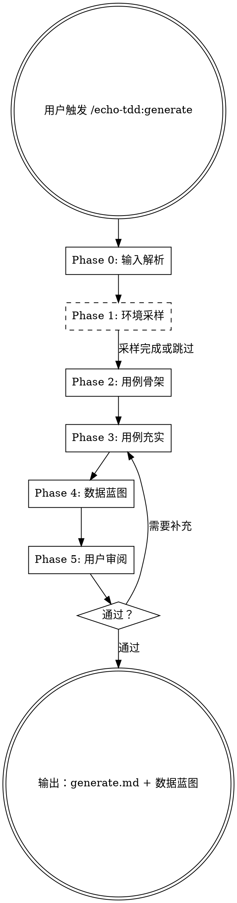

# Echo-TDD Generate — 测试用例 + 数据蓝图生成器

基于前两阶段的产出，生成**个性化的测试用例文档 + 测试数据蓝图**。

输入是 `docs/echo-tdd/<topic>/plan.md` 加上 `docs/echo-tdd/<topic>/verify.md`。输出是 `docs/echo-tdd/<topic>/generate.md`，供后续实现阶段转化为代码。

<HARD-GATE>
1. 产出是**测试用例文本**，不是测试代码。代码化属于后续阶段。
2. 每个用例的触发方式和观测方式必须**适配用户实际可用的通道**——从可观测性方案和探测报告中提取，不能假设不存在的通道。
3. 不要在所有维度信息提取完成前就开始生成用例。
</HARD-GATE>

## 核心原则

```
策略驱动，用例基于阶段一的分层和可观测性方案
环境适配，数据准备/执行/验收方式适配阶段二确认的实际通道
真实采样，有条件时从环境中采样真实数据结构辅助用例设计
丰富完善，用例和数据尽可能全面覆盖，不刻意精简
分级执行，核心场景优先验收（P0），边缘场景排后（P2）
分层策略，不同测试层用不同的数据生命周期
文本产出，只生成用例文档不生成代码
```

## Checklist

你 MUST 按顺序完成以下步骤，为每个步骤创建 task：

1. **Phase 0: 输入解析** — 读取策略文档和探测报告，提取关键约束
2. **Phase 1: 环境采样**（可选）— 通过已验证的通道采样真实数据结构
3. **Phase 2: 用例骨架生成** — 对每个被测功能系统化推导
4. **Phase 3: 用例充实** — 用户旅程、真实数据、维度矩阵、优先级标注
5. **Phase 4: 数据蓝图生成** — 汇总数据需求，分层组织
6. **Phase 5: 用户审阅** — 展示用例和蓝图，征求确认

## 流程图



---

## Phase 0: 输入解析

读取前两阶段的产出，提取用例生成所需的关键信息。

### 必须提取的内容

| 来源 | 提取什么 | 用途 |
|------|---------|------|
| 方案文档 第 1 节 | 测试范围和排除项 | 确定用例边界——哪些功能需要用例，哪些明确排除 |
| 方案文档 第 3 节 | 测试分层结构 | 决定用例按哪些层组织（如：认证→只读→写操作→端到端） |
| 方案文档 第 3 节 | 可观测性方案（触发×观测组合） | **决定每个用例的触发方式和验收方式** |
| 方案文档 第 4 节 | 数据流闭环 | 决定数据蓝图的结构（准备→送入→验证→清理） |
| 方案文档 第 5 节 | 认证方案 | 认证相关用例 + 数据准备的认证前提 |
| 探测报告 | 各通道的 PASS/FAIL/WARN | **决定哪些通道实际可用，用例必须适配** |
| 脚手架代码 | data-factory、client 的接口 | 数据蓝图中引用已有的工厂函数名 |

### 环境适配逻辑

**关键**：如果探测报告中某个通道 FAIL，相关用例的验收方式必须降级到其他可用通道。

```
if SDK 通道 PASS:
    → 用 SDK 做独立验证（最强）
elif DB CLI 通道 PASS:
    → 用 DB 查询做独立验证
elif API 通道 PASS:
    → 用 API 交叉查询验证（次强）
elif 只有 UI 通道:
    → 用浏览器 UI 检查验证（最弱，标注局限性）
```

每个用例的"观测方式"列必须反映实际可用的通道，不能写用户环境中不存在的通道。

---

## Phase 1: 环境采样（可选）

当阶段二已验证某些观测通道可用时，利用这些通道**只读**采样真实环境中的数据，为后续用例设计提供现实参考。

### 何时执行

- 探测报告中有 PASS 的数据查询通道（SDK/DB CLI/API）→ 可以采样
- 用户同意 → 执行采样
- 用户拒绝或无可用通道 → 跳过，用通用假设

### 采样目标

| 采样内容 | 方法 | 用途 |
|---------|------|------|
| 数据结构 | SDK/API 查询目录树深度和广度 | 确定嵌套深度测试的现实参考值 |
| 值分布 | SDK/API 统计各类型占比 | 决定哪些类型需要测试、优先级怎么标 |
| 边界值 | SDK/API 查询最大/最小值 | 补充边界值分析（如最长文件名、最多子项数） |
| 字符特征 | SDK/API 采样文件名字符集 | 确定是否需要中文/特殊字符/emoji 用例 |
| 数据量级 | SDK/API 统计总量 | 确定分页测试的阈值参考 |

### 采样方式

根据可用通道选择：

```
SDK 可用：
  → client.listFolder(root) 递归采样，统计结构
  → 汇总文件类型、名称长度、嵌套深度

DB CLI 可用：
  → SELECT type, COUNT(*) FROM files GROUP BY type
  → SELECT MAX(LENGTH(name)) FROM files
  → SELECT MAX(depth) FROM directories

API 可用：
  → GET /api/files?page_size=1 获取总量
  → GET /api/files?sort=name_length&order=desc&limit=5 获取最长名称

浏览器可用：
  → 通过 Playwright snapshot 获取页面数据结构
```

### 采样输出格式

```
## 环境数据采样报告

采样时间：[日期]
采样通道：[SDK / DB CLI / API]

### 结构特征
- 最大嵌套深度：[N] 层
- 单文件夹最多子项：[N] 个
- 总文件/文件夹数：[N] 个

### 类型分布
| 类型 | 数量 | 占比 |
|------|------|------|
| [type1] | [n] | [%] |
| [type2] | [n] | [%] |

### 命名特征
- 最长名称：[N] 字符（"[示例]"）
- 包含中文名称：[是/否]（占比 [%]）
- 包含特殊字符：[是/否]（类型：[空格/括号/...]）

### 边界发现
- [描述任何意外或值得测试的边界情况]
```

**安全原则**：
- 采样是**只读操作**，不创建/修改/删除任何数据
- 不采样敏感内容（只看结构和元数据，不读文档正文）
- 采样前向用户确认

---

## Phase 2: 用例骨架生成

对方案文档中每个被测功能，系统化推导用例。这是用例的"骨架"——覆盖核心逻辑，后续 Phase 3 再充实。

### 方法：属性建模 + 等价类 + 边界值

对每个被测功能：

**步骤 1：识别输入参数和可变维度**

列出该功能的所有输入参数，以及每个参数的可变属性。

**步骤 2：属性建模**

为每个参数建立属性模型：

```
<函数/命令名> 的属性模型：

参数 1 属性：
  - 维度 A: 值1 | 值2 | 值3
  - 维度 B: 值1 | 值2
  - ...

参数 2 属性：
  - 维度 C: 值1 | 值2 | 值3 | 值4
  - ...

环境属性（非参数，但影响行为）：
  - 认证状态: 有效 | 过期 | 无凭证
  - 网络状态: 正常 | 超时 | 断连
```

**步骤 3：等价类划分**

对每个维度，划分有效等价类和无效等价类。

**步骤 4：边界值提取**

对每个维度，识别边界值（空/非空、0/1/max、阈值前后等）。如果 Phase 1 有采样数据，用采样发现的实际边界值。

**步骤 5：生成用例表**

组合等价类和边界值，生成用例表。使用笛卡尔积但做裁剪——不需要全组合，用 pairwise（两两覆盖）或风险驱动裁剪。

详细的覆盖策略模式参见 `coverage-patterns.md`。

### 每个功能的产出

一张用例表，包含：正常路径用例、异常路径用例、边界值用例。每个用例包含：
- 编号
- 用例名称
- 前置条件（需要什么数据/状态）
- 触发（具体操作）
- 预期结果
- 观测方式（必须适配实际可用通道）
- 优先级（暂标 P0/P1/P2，Phase 3 细化）

---

## Phase 3: 用例充实

在骨架基础上，从四个方向补充和完善。

### 3.1 用户旅程

设计 2-3 个完整的端到端使用故事，覆盖真实场景：

```
故事格式：
  角色：[谁在用]
  目标：[要完成什么]
  前置：[起始状态]
  步骤：
    1. [操作] → [期望结果]
    2. [操作] → [期望结果]
    ...
  终态：[完成后的状态]
```

用户旅程中的每一步都要能映射到用例表中的具体用例。如果发现旅程中有步骤没有对应用例，补充新用例。

### 3.2 真实数据补充

如果 Phase 1 采样了真实数据：
- 将采样发现的**实际边界值**（如最长文件名 47 字符）加入用例，替换通用假设
- 将采样发现的**类型分布**用于决定哪些类型需要专门测试（如 bitable 占 6%，需要覆盖）
- 将采样发现的**实际嵌套深度**作为深层路径测试的参考值
- 将采样发现的**字符特征**补充字符集测试用例

### 3.3 维度矩阵查漏

将所有关键维度列成交叉矩阵，检查是否有未覆盖的组合：

```
         路径域    路径深度   字符集    内容量   内容类型
用例 1   /drive/   根(0)     ASCII    正常     纯文件夹
用例 2   /wiki/    1层       中文     空       混合
用例 3   /drive/   2+层      特殊字符  大量     纯文档
...
```

标注哪些组合已覆盖、哪些未覆盖。对未覆盖的组合：
- 有价值 → 补充用例
- 无价值（如不可能出现的组合）→ 标注原因并跳过

### 3.4 优先级标注

为每个用例标注优先级：

| 级别 | 含义 | 执行时机 | 典型场景 |
|------|------|---------|---------|
| **P0** | 冒烟 | 每次提交 | 核心正常路径、认证通过、基本 CRUD |
| **P1** | 回归 | 版本发布前 | 重要异常路径、边界值、中文/特殊字符 |
| **P2** | 完整 | 定期/里程碑 | 罕见边界、极端数据量、兼容性、错误恢复 |

标注原则：
- 用户旅程中涉及的步骤至少 P0
- 采样发现的真实边界至少 P1
- 理论推导的极端场景为 P2

---

## Phase 4: 数据蓝图生成

汇总所有用例的数据需求，按测试层组织成可执行的数据蓝图。

### 蓝图结构

参见 `data-blueprint-guide.md` 了解详细的设计指导。

蓝图必须包含：

1. **全局数据**：所有层共享的基础数据（认证凭证等）
2. **分层数据表**：每层需要的数据，包含：
   - 数据名称
   - 类型和详情
   - 创建方式（通过哪个通道创建——适配实际环境）
   - 生命周期（何时创建、何时清理）
   - 被哪些用例引用
   - 优先级（P0/P1/P2）
3. **分层数据生命周期**：每层的 setup/teardown 策略
4. **数据量统计**：按优先级汇总

### 分层生命周期模式

```
第 1 层（认证）：无预置数据 / 或仅需凭证配置
第 2 层（只读）：beforeAll 创建全量 fixture → 所有只读用例复用 → afterAll 清理
第 3 层（写操作）：beforeEach 创建必需的父目录/容器 → 用例执行写操作 → afterEach 清理
第 4 层（端到端）：每个用例独立管理完整数据生命周期
```

### 数据量控制

不刻意精简——尽可能覆盖各种变体，但通过优先级分级控制执行节奏：
- **P0 数据**：核心正常路径所需，每次测试都创建
- **P1 数据**：边界值和重要变体，回归测试时创建
- **P2 数据**：罕见边界和极端场景，完整验收时创建

---

## Phase 5: 用户审阅

展示用例清单和数据蓝图，征求用户确认。

### 展示内容

1. **用例统计**：按层、按功能、按优先级的汇总表
2. **覆盖度分析**：维度矩阵中的覆盖/未覆盖情况
3. **数据蓝图摘要**：数据量、分层策略
4. **用户旅程概览**：2-3 个端到端故事的摘要

### 征求确认

- 覆盖度是否满意？有无遗漏的功能或场景？
- 优先级标注是否合理？
- 数据蓝图是否可行？
- 用户旅程是否贴合实际使用场景？

### 输出

用户确认后，将用例文档和数据蓝图保存为 markdown 文件。位置由用户决定（默认 `docs/test-cases.md`）。

---

## 注意事项

### 不要做的事

- 不要生成测试代码——只生成用例文本
- 不要假设不存在的观测通道——必须基于探测报告
- 不要刻意精简用例——丰富覆盖后用优先级控制执行
- 不要用机械化的全组合——用 pairwise 或风险裁剪
- 不要忽略采样数据——真实环境的发现比理论推导更有价值

### 与前两阶段的关系

- 阶段一的可观测性方案决定了**测什么、怎么观测、数据怎么流转**
- 阶段二的探测报告决定了**实际能用什么通道、哪些通道不可用**
- 阶段三基于这些约束生成**具体的用例和数据蓝图**
- 后续阶段（尚未设计）会把用例文本转化为可执行的测试代码

---

## 参考文件

- `coverage-patterns.md` — 用例覆盖策略模式库（等价类、边界值、属性建模、裁剪）
- `data-blueprint-guide.md` — 测试数据蓝图设计指导
- `output-template.md` — 测试用例文档输出模板
- `examples/cli-feishu-cases.md` — fz 项目的完整阶段三示例
