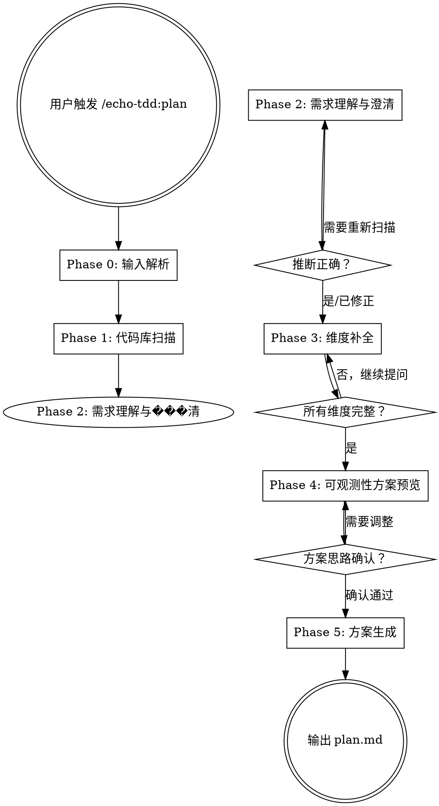

# Echo-TDD Plan — 可观测性测试计划生成器

基于用户的需求和实际开发环境，生成一份**可观测性方案**。这份方案回答核心问题：**我们能通过什么通道触发系统、通过什么通道观测结果**——是 Vibe Coding 自反馈循环的第一步。

阶段一产出的是可观测性方案，不是详细用例。详细的测试用例和数据准备属于阶段三。

<HARD-GATE>
在所有维度信息收集完成之前，不要生成可观测性方案。不完整的环境信息会导致不可行的方案。
</HARD-GATE>

## 核心原则

```
推断优先，不问能推断的
一次一问，不抛一堆问题
组合化思维，不贴角色标签
不问隐私，不问无关信息
动态探测，能验证的不靠猜
集成优先，尽可能做端到端的真实验证
可观测性为核心，Phase 1 的首要产出是梳理清楚触发和观测通道
项目类型感知，不同项目类型的可观测性重心不同
```

## 核心测试理念

### 集成测试优先

所有测试尽可能做集成验证，不追求纯单元测试。分层是按**业务模块**分，而不是按技术层分：

```
第 1 层：认证/公共模块 — 先确保基础能力通
第 2 层：核心业务模块 — 在基础通过后验证业务
第 3 层：端到端全链路 — 从用户视角跑完整流程
```

每一层都是集成的——连接真实数据库、调真实 API、操作真实 UI。

### 数据流闭环

每个测试都要回答四个问题：

```
1. 数据从哪来？
   本地文件/DB seed → 确定性最高
   通过 API 创建   → 中等确定性
   用已有数据       → 最不可控
   mock/replay     → 用于不可控的外部数据源

2. 数据怎么送入环境？
   DB 直接写入     → 最快、最可控
   API 调用创建    → 当无 DB 权限时
   UI 操作创建     → 最慢、最后选择
   文件系统放置    → 静态测试数据

3. 怎么验证结果？
   独立通道验证（DB 查询）  → 最可靠，避免被测模块自证
   SDK + 凭证直查           → 第三方系统的独立验证
   API 交叉查询            → 当无 DB 权限时
   UI 元素检查             → 当只有浏览器时
   输出比对（stdout/日志）  → CLI 工具等场景

4. 怎么清理？
   DB reset/truncate    → 可清空时
   API DELETE           → 有权限时
   标记隔离（前缀/标记） → 定期清理
   不清理               → 数据不重要时
```

核心原则：**准备走底层通道（能 DB 就不走 API），验证走独立通道（不要用被测模块验证自己）。**

### 渐进式真实度

当系统涉及**金钱、时间流、外部副作用**时，采用渐进式验证：

```
Mock/本地模拟  →  服务商沙盒环境  →  真实环境最小验证
（最安全）        （接近真实）        （需用户授权）
```

- **优先用服务商提供的沙盒**（如支付宝沙盒、券商模拟盘）— 最省力、最接近真实
- **没有沙盒则自己 mock** — 可控但需要维护
- **沙盒跑通后再考虑真实最小验证** — 目的是验证「系统打通」，不是验证业务逻辑
- **不是所有系统都需要三层** — 简单项目只需要第一层

适用场景：支付系统、交易系统、消息发送（邮件/短信）、第三方 OAuth、定时任务、消息队列等。

---

## Checklist

你 MUST 按顺序完成以下步骤，为每个步骤创建 task：

1. **Phase 0: 输入解析** — 解析用户传入的参数
2. **Phase 1: 代码库扫描** — 自动推断六大维度信息
3. **Phase 2: 需求理解与澄清** — 展示推断结果，用户确认/修正
4. **Phase 3: 维度补全** — 逐维度补问缺失信息
5. **Phase 4: 可观测性方案预览与确认** — 生成简洁的可观测性摘要，用户确认方向
6. **Phase 5: 方案生成** — 生成完整的可观测性方案 markdown

## 流程图



---

## Phase 0: 输入解析

解析用户在触发 `/echo-tdd:plan` 时传入的参数：

- **文档路径**（如 `@docs/spec.md` 或用户说"需求在 xxx.md 中"）→ 读取文档，提取需求
- **自然语言描述**（如"我要测试用户注册流程"）→ 记录需求
- **无参数** → 进入纯代码库推断模式，Phase 2 时再和用户讨论需求

无论哪种输入，都记录下来，作为后续扫描和提问的上下文。

### topic 提取

确定文件名中的 `<topic>` 部分，用于构造输出文件名 `YYYY-MM-DD-<topic>-plan.md`：

**提取策略**：
- 如果用户提供文档路径（如 `@docs/fz-feishu-sync-spec.md`），从文件名提取（`fz-feishu-sync`）
- 如果用户用自然语言描述（如"测试用户注册流程"），提取关键词（`user-registration`）
- 如果无明显 topic，根据代码库名称推断（如项目名）或提示用户输入

**topic 规范化**：
- 转为 kebab-case（`userRegistration` → `user-registration`）
- 移除特殊字符（只保留字母、数字、连字符）
- 限制长度 ≤ 40 字符
- 全小写

**记录变量**：将规范化后的 topic 记录为 `planTopic` 变量，供 Phase 5 生成文件名时使用。

**示例**：
- 输入：`@docs/fz-feishu-sync.md` → `planTopic = "fz-feishu-sync"`
- 输入："测试飞书文档同步" → `planTopic = "feishu-doc-sync"`
- 输入：无，项目名为 `my-app` → `planTopic = "my-app"`

---

## Phase 1: 代码库扫描（智能推断）

自动扫描当前代码库，推断六大维度的信息。你自行决定扫描策略，但需要覆盖以下推断目标：

- 项目类型和技术栈（语言、框架、依赖）
- 数据库类型和配置方式（ORM、migration、连接配置）
- 已有的测试基础设施（测试框架、测试文件、CI 配置）
- API / 路由结构（端点清单、GraphQL schema）
- 认证方式（auth 中间件、JWT/session 配置）
- 部署和运行方式（Docker、Makefile、启动脚本）
- **可观测性资源**：项目依赖中的第三方 SDK（如飞书 SDK、AWS SDK、Stripe SDK）、`.env` 中的 API Key/Secret、已有的辅助脚本和测试工具（`scripts/`、`tools/`、`test/helpers/`）

将推断结果整理为结构化的「环境画像」，准备展示给用户。

### 项目类型与可观测性重心

代码库扫描确定项目类型后，应用以下可观测性重心引导：

```
WebUI / SPA / 前端应用：
  → 浏览器是主要观测平台（DOM + Console + Network + Visual + Storage + URL）
  → 后端 API/WS/DB 是辅助独立验证通道
  → 关键：不要把浏览器仅当"触发器"——它同时是最核心的观测通道

CLI 工具：
  → stdout/stderr/exitCode 是主要观测通道
  → SDK/API 是辅助独立验证通道

后端 API 服务：
  → API 响应（状态码、body）是主要观测通道
  → DB 直查是辅助独立验证通道

全栈应用：
  → 浏览器 + DB/API 双向交叉验证

桌面/移动端应用：
  → 应用界面（通过自动化工具）是主要观测通道
  
MacOS APP / 桌面应用（MacOS）：
  → mac-use 是 MacOS 上首选的自动化测试方案（提供原生 UI 操作能力）
  → 可观测 UI 元素、窗口状态、菜单操作、系统通知等
  → 辅助验证通道：文件系统、本地 DB（如有）、系统日志
  → 关键：mac-use 能直接操作原生 UI，比 AppleScript 更可靠和灵活
```

这个重心引导影响后续可观测性方案的生成——确保主要通道被充分展开，辅助通道作为补充。

参考 `dimensions.md` 了解每个维度的详细定义和推断线索。

---

## Phase 2: 需求理解与澄清

### 展示推断结果

将 Phase 1 的推断结果清晰地展示给用户。格式示例：

```
基于代码库扫描，我推断出以下信息：

【代码仓库】Next.js 全栈应用（TypeScript）
【技术栈】Next.js 14 + PostgreSQL + Prisma + NextAuth
【数据库】本地 Docker PostgreSQL（从 docker-compose.yml 推断）
【测试现状】Playwright 已配置但无测试用例
【API 结构】发现 15 个 API 路由（/api/auth/*, /api/users/*, ...）
【认证方式】NextAuth + credentials provider
【部署方式】Docker Compose 本地开发

以上推断是否正确？有哪些需要修正？
```

### 澄清需求

结合代码库信息和用户输入，讨论测试目标：
- **具体要测试哪些功能？** — 确认测试范围和边界
- **哪些功能明确排除？** — 确认不在范围内的部分
- **有没有特别关注的风险点？** — 了解用户重点关注的场景

**默认策略**：方案阶段做最全面的覆盖，尽全力探索测试的极限边界。测试用例分级（P0/P1/P2）在阶段三（generate）进行，不在阶段一限制范围。

如果用户在 Phase 0 没有提供需求，这里需要引导用户描述。

---

## Phase 3: 维度补全

对仍然缺失或不确定的维度逐一提问。

### 提问原则

1. **能推断的不问** — 已从代码库确认的不再重复
2. **一次只问一个维度** — 不要一次抛出一堆问题
3. **提供选项** — 尽可能给选择题而非开放题
4. **不运行探测脚本** — Phase 1 只收集信息，所有环境验证都在阶段二（verify）进行

### 可观测性维度的提问策略

可观测性维度需要特别注意提问顺序：
1. **先识别基础通道** — 基于已推断的基础设施信息，确认用户可以使用哪些基础观测通道（浏览器、DB CLI、API 等）
2. **再探测组合通道** — 主动询问是否有可用的第三方 SDK + 凭证、辅助脚本等。这些往往是扩展观测能力的关键
3. **确定触发×观测组合** — 针对需要测试的功能，明确每个测试场景的触发通道和观测通道分别是什么

### 六大维度

详细的维度定义、可能值和提问指南参见 `dimensions.md`。

---

## Phase 4: 可观测性方案预览与确认

<HARD-GATE>
在六大维度完整收集并确认后，立即进入本阶段。Phase 4 是方向对齐的关键检查点——在生成完整 plan.md 之前，用提问式确认让用户快速验证核心决策，避免方向错误导致后续返工。
</HARD-GATE>

### 目标

向用户展示 4 个关键决策点，收集用户对每个决策的反馈。

这是一次**决策确认**，不是信息收集（信息收集在 Phase 3 已经完成）。

### 实现方式

**优先使用平台的结构化提问工具**（如果支持）：
- **Claude Code**：使用 `AskUserQuestion` 工具
- **其他平台**：使用各自提供的结构化问答工具

**如果平台不支持结构化提问**，则降级为传统方式：
逐个展示决策点，每个决策点后等待用户文本回复。

### 每个决策点的选项

- ✅ **确认** - 这个决策没问题
- ⏭️ **跳过** - 暂时不确定，标记为待确认
- ✏️ **修改** - 用户输入具体的修改意见
  - 结构化提问时：通过 Other 选项输入
  - 传统方式时：直接文本输入

### 4 个决策点

基于已收集的六大维度信息，形成以下 4 个决策并向用户确认。每个决策点包含：问题描述、决策内容、选项。

#### 决策 1：可观测性重心与通道角色

**问题描述**（用于结构化提问的 question 字段）：
"基于项目类型和环境，我计划的可观测性重心是：[主要观测平台]、[辅助验证通道]、[组合通道（如有）]。这个划分是否合理？"

**决策内容**（展开说明）：
- 项目类型决定了什么是主要观测平台
- 主要观测通道是哪些（承担大部分验证工作的）
- 辅助验证通道是哪些（用于独立交叉验证的）
- 如果有组合通道（SDK + 凭证、自建辅助 API、自动化脚本），说明它们扩展了什么观测能力

**header**（用于结构化提问）：`"观测重心"`

**示例**：
"这是一个 Next.js 全栈应用。我计划：主要观测平台为浏览器（Playwright），辅助验证通道为 PostgreSQL 直查，组合通道为飞书 Node SDK + 应用凭证。这个可观测性重心是否合理？"

#### 决策 2：触发 × 观测的核心组合

**问题描述**：
"以下是每个功能模块的触发和观测组合：[表格]。这些组合是否合理？"

**决策内容**（用表格展示）：
- 每个功能模块怎么触发、用什么观测、用什么辅助验证
- 为什么选择这个组合（简要说明）

**header**：`"触发组合"`

**注意**：表格内容可以在问题描述中展示，也可以在问题前展示（根据平台工具能力）

#### 决策 3：数据流闭环策略

**问题描述**：
"测试数据计划：准备方式为 [准备方式]，验证方式为 [验证方式]，清理方式为 [清理方式]。这个数据流闭环策略是否合理？"

**决策内容**（展开说明）：
- 数据准备方式及原因（DB seed / API 创建 / 用已有数据 / mock）
- 验证策略及原因（独立通道验证 / 交叉验证 / 自身验证——如果是自身验证要说明为什么可以接受）
- 清理策略（DB reset / API DELETE / 标记隔离 / 不清理）

**header**：`"数据闭环"`

**示例**：
"测试数据计划：准备方式为 DB seed（本地 PostgreSQL 可清空，用 Prisma seed 脚本注入测试数据），验证方式为独立通道（浏览器 DOM 检查 + DB 直查），清理方式为 DB reset（每次测试前 prisma migrate reset）。这个数据流闭环策略是否合理？"

#### 决策 4：约束、存疑与特殊处理

**问题描述**：
"以下是方案中的约束和特殊处理：[列出约束项]。这些约束和应对方式是否可以接受？"

**决策内容**（展开说明）：
- 哪些功能/模块无法通过独立通道观测？为什么？降级方案是什么？
- 是否有不确定项需要用户进一步确认？
- 如果涉及金钱/时间流/外部副作用，说明渐进式真实度的方案（Mock → 沙盒 → 真实最小验证）

**header**：`"约束应对"`

**示例**：
"以下是方案中的约束和特殊处理：(1) 飞书 webhook 回调无法在本地模拟，计划用 mock 替代，后续在 verify 阶段探测是否可用 ngrok；(2) 飞书 SDK 的应用凭证需要你提供；(3) 不涉及金钱/时间流，无需渐进式真实度。这些约束和应对方式是否可以接受？"

### 实施指南

**使用结构化提问工具时**（Claude Code 的 AskUserQuestion 为例）：

一次展示 4 个问题，每个问题包含：
- `question`：决策点的具体问题（见上文各决策点的"问题描述"）
- `header`：决策标签（如"观测重心"、"触发组合"）
- `multiSelect`: false（单选）
- `options`：
  - 选项 1：`{ label: "✅ 确认", description: "这个决策没问题" }`
  - 选项 2：`{ label: "⏭️ 跳过", description: "暂时不确定，标记为待确认" }`
  - （系统自动提供 Other 选项，用户可输入修改意见）

**使用传统方式时**（平台不支持结构化提问）：

逐个展示决策点，格式：

```
基于前面收集的信息，以下是可观测性方案的 4 个关键决策。

---

【决策 1：可观测性重心】

这是一个 Next.js 全栈应用。我计划：
- 主要观测平台：浏览器（Playwright）
- 辅助验证通道：PostgreSQL 直查
- 组合通道：飞书 Node SDK + 应用凭证

请回复：
- "确认" - 继续
- "跳过" - 标记为待确认
- 或直接输入修改意见

---

【决策 2：触发×观测组合】

| 功能模块 | 触发通道 | 主要观测 | 辅助验证 |
|---------|---------|---------|---------|
| 用户注册 | 浏览器填写表单 | DOM 状态 + URL 跳转 | DB 查询 user 表 |
| ... | ... | ... | ... |

请回复：
- "确认" - 继续
- "跳过" - 标记为待确认
- 或直接输入修改意见

---

[决策 3、4 类似]
```

每展示一个决策点，等待用户回复，然后处理下一个。

### 用户回复的处理

结构化提问和传统方式的处理逻辑相同：

- **全部确认** → 直接进入 Phase 5 生成完整文档（plan、observability、checklist）
- **部分确认 + 部分修改** → 采纳修改意见，对修改的决策点重新展示确认
- **选了"跳过"** → 在 Phase 5 生成的 `plan.md` 和 `observability.md` 中将该决策标注为「⚠️ 待确认」，不阻塞方案生成
- **方向性分歧严重** → 返回 Phase 2 或 Phase 3 重新收集信息

### 注意事项

- **这是决策确认，不是信息收集** — 不要在这个阶段提出新的开放性问题，所有信息应该已经在 Phase 3 收集完毕
- **每条决策要给出你的判断和理由** — 不要只列选项让用户从零选择，要展示"我打算这样做，因为..."
- **主动暴露约束** — 不要藏着局限性，用户知道约束才能做出正确判断
- **允许跳过** — "跳过"是合理的回答，不要强迫用户在每个点上都做决定
- **平台工具优先** — 优先使用平台的结构化提问工具，降低用户输入成本

---

## Phase 5: 方案生成

基于完整的六大维度信息和用户确认的可观测性思路，分三次生成文档，避免单次输出过大导致超时。

### 输出定位

阶段一输出的是**可观测性方案**，核心回答三个问题：

1. **我们理解你的系统** — 环境画像和维度快照
2. **我们能观测到什么** — 触发通道、观测通道、触发×观测组合矩阵、约束与局限
3. **数据如何流转** — 数据流闭环方案、测试分层概要

用 1-2 个方向性示例说明观测思路即可，不要铺开完整的测试用例清单。

### 目录和命名

输出文件保存在 `docs/echo-tdd/plans/` 目录下，使用时间戳 + topic 命名：

- 主文档：`docs/echo-tdd/plans/YYYY-MM-DD-<topic>-plan.md`
- 可观测性详情：`docs/echo-tdd/plans/YYYY-MM-DD-<topic>-observability.md`
- 环境前置条件：`docs/echo-tdd/plans/YYYY-MM-DD-<topic>-checklist.md`

其中：
- `YYYY-MM-DD`：生成当天日期（如 `2026-04-05`）
- `<topic>`：Phase 0 提取的 planTopic 变量（kebab-case 格式）

**示例**：
```
docs/echo-tdd/plans/2026-04-05-fz-feishu-sync-plan.md
docs/echo-tdd/plans/2026-04-05-fz-feishu-sync-observability.md
docs/echo-tdd/plans/2026-04-05-fz-feishu-sync-checklist.md
```

### 生成策略

分三次生成，每次控制在 6K tokens 以内，避免输出超时：

#### 步骤 1：生成主文档

使用 Write 工具创建 `YYYY-MM-DD-<topic>-plan.md`，参考 `output-template-plan.md`。

**内容要求**：
- 第 1 节"需求概述"增加"需求来源"小节（记录 Phase 0 的输入来源）
- 第 2 节"环境画像"完整填充
- 第 3 节"可观测性方案"为摘要版，包含：
  - 整体策略（2-3 段话）
  - 通道角色（列表形式）
  - 关键功能模块组合（简化表格，3-5 行）
  - 添加指向 `observability.md` 的相对路径链接
- 第 4-6 节完整填充
- 第 7 节"环境前置条件"为概览版，只展示 3-5 个最关键条件，添加指向 `checklist.md` 的链接
- 第 8 节"后续阶段展望"完整填充

**目标大小**：3-4K tokens

**告知用户**：
> 正在生成主文档 `docs/echo-tdd/plans/YYYY-MM-DD-<topic>-plan.md`...

#### 步骤 2：生成可观测性详情

使用 Write 工具创建 `YYYY-MM-DD-<topic>-observability.md`，参考 `output-template-observability.md`。

**内容要求**：
- 顶部元信息区添加返回主文档的相对路径链接
- "整体可观测性策略"详细阐述（4-5 段话）
- 完整的基础通道表（所有通道，包含说明列）
- 如果是 WebUI 项目，必须展开浏览器子通道（DOM、Console、Network、Visual、Storage、URL）
- 完整的组合通道表（如有）
- 完整的触发×观测矩阵（所有功能模块，包含数据准备和清理列）
- 详细的约束与局限说明
- 如适用，完整的渐进式真实度表格

**目标大小**：5-6K tokens

**告知用户**：
> 正在生成可观测性详情 `docs/echo-tdd/plans/YYYY-MM-DD-<topic>-observability.md`...

#### 步骤 3：生成环境前置条件

使用 Write 工具创建 `YYYY-MM-DD-<topic>-checklist.md`，参考 `output-template-checklist.md`。

**内容要求**：
- 顶部元信息区添加返回主文档的相对路径链接
- 按 6 层依赖关系组织（基础运行环境 → 依赖安装 → 认证/凭证 → 基础通道可达性 → 组合通道可用性 → 数据操作权限）
- 每项包含：验证命令、期望结果、说明
- 底部添加统计汇总（总计和各层分布）

**目标大小**：2-3K tokens

**告知用户**：
> 正在生成环境前置条件 `docs/echo-tdd/plans/YYYY-MM-DD-<topic>-checklist.md`...

### 最终确认

生成三个文档后，告知用户：

> 可观测性方案已生成：
> - 主文档：`docs/echo-tdd/plans/YYYY-MM-DD-<topic>-plan.md`
> - 可观测性详情：`docs/echo-tdd/plans/YYYY-MM-DD-<topic>-observability.md`
> - 环境前置条件：`docs/echo-tdd/plans/YYYY-MM-DD-<topic>-checklist.md`
>
> 请审阅主文档，如有需要可查看详情文档。确认无误后我们可以进入下一阶段。

此时方向已在 Phase 4 对齐，这次确认重点是**完整性和细节**——检查环境画像是否准确、观测通道是否详尽、数据流闭环是否清晰、环境前置条件 checklist 是否完整。如果有遗漏或细节需要调整，修改后直接保存。

### 下一步引导

方案审阅通过后，向用户提问下一步方向：

- **环境确认 + 脚手架**（推荐）— 先验证环境、搭建测试基础设施，再生成具体用例。运行 `/echo-tdd:verify @docs/echo-tdd/plans/YYYY-MM-DD-<topic>-plan.md` 进入阶段二
- **先生成测试用例** — 先看到具体的测试用例，之后再验证环境

默认推荐前者。阶段二会逐项验证环境前置条件，生成认证 helper、数据工厂、通道客户端等测试基础设施代码，并用 smoke test 证明一切就绪。

---

## 注意事项

### 不要做的事

- 不要用角色标签（如"大厂开发者"、"个人开发者"）来分类用户
- 不要问团队规模等隐私问题
- 不要假设用户的环境——推断或问
- 不要一次性问太多问题
- 不要在阶段一就铺开完整的测试用例清单——可观测性方案只需要 1-2 个方向性示例
- 不要生成不可执行的泛泛而谈的方案

### 组合化思维

每个用户的真实环境是六大维度值的**唯一组合**。例如：
- DB 本地可清空 + 服务本地 + 前端本地 + 可自注册
- DB 远程只读 + 服务本地 + 无前端 + 需提供密码
- 无 DB 访问 + API 远程 dev + 前端本地连远程 + cookie 导入

不要试图把用户塞进预设的场景模板。用维度组合来描述实际情况。

参考 `examples/` 目录下的示例了解典型组合的可观测性方案。

---

## 参考文件

- `dimensions.md` — 六大维度的详细定义、可能值、推断线索、提问模板
- `output-template.md` — 可观测性方案输出 markdown 模板
- `examples/` — 典型维度组合的可观测性方案示例
