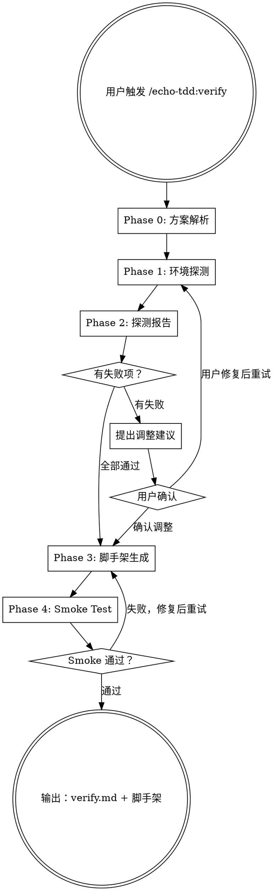

# Echo-TDD Verify — 环境确认 + 测试基础设施验证器

基于阶段一的可观测性方案，**验证环境 → 生成脚手架 → smoke test 跑通**。

输入是一份已审阅通过的 Echo-TDD 计划文档（通常是 `docs/echo-tdd/<topic>/plan.md`），输出是验证报告 `docs/echo-tdd/<topic>/verify.md` 以及可运行的最小测试基础设施代码。

<HARD-GATE>
必须先读取并理解可观测性方案，才能开始任何探测。不要凭空猜测环境情况——方案文档中已经包含了所有需要验证的前置条件。
</HARD-GATE>

## 核心原则

```
策略驱动，一切探测基于阶段一产出的前置条件 checklist
探测即验证，每次探测都是一个可观测的 pass/fail
失败不阻塞，通道不可用时调整策略而非报错停止
脚手架即代码，产出物是可运行的代码不是文档
smoke test 收尾，一个最小测试跑通证明一切就绪
跟随项目技术栈，不预设语言/框架，看项目用什么就用什么
```

## Checklist

你 MUST 按顺序完成以下步骤，为每个步骤创建 task：

1. **Phase 0: 方案解析** — 读取可观测性方案，提取探测清单和关键信息
2. **Phase 1: 环境探测** — 按依赖顺序逐项探测
3. **Phase 2: 探测报告 + 策略调整** — 展示结果，处理失败项
4. **Phase 3: 脚手架生成** — 基于确认后的环境生成代码
5. **Phase 4: Smoke Test** — 运行最小测试验证脚手架可用

## 流程图



---

## Phase 0: 方案解析

读取用户提供的可观测性方案，支持新旧两种路径格式。

### 路径格式支持

**新格式（优先，阶段一 v1.1+ 生成）**：
- 主文档：`docs/echo-tdd/plans/YYYY-MM-DD-<topic>-plan.md`
- Checklist：`docs/echo-tdd/plans/YYYY-MM-DD-<topic>-checklist.md`
- 可观测性详情（按需）：`docs/echo-tdd/plans/YYYY-MM-DD-<topic>-observability.md`

**旧格式（兼容，阶段一 v1.0 生成）**：
- 主文档：`docs/echo-tdd/<topic>/plan.md`
- checklist 和可观测性详情在主文档内

**读取策略**：
1. 如果用户提供了完整路径参数（如 `/echo-tdd:verify @docs/echo-tdd/plans/2026-04-05-fz-feishu-sync-plan.md`），按参数读取
2. 如果用户只提供了 topic，先尝试新格式（按日期倒序查找最新）
3. 如果新格式不存在，尝试旧格式 `docs/echo-tdd/<topic>/plan.md`
4. 都不存在，提示用户提供正确路径

### 必须提取的内容

| 来源 | 新格式 | 旧格式 | 提取什么 | 用途 |
|------|--------|--------|---------|------|
| 需求来源 | plan.md 第 1 节 | plan.md 第 1 节（如有） | 原始需求文档位置 | 追溯需求，辅助脚手架设计 |
| 环境画像 | plan.md 第 2 节 | plan.md 第 2 节 | 技术栈、基础设施详情 | 决定脚手架语言/框架、探测目标 |
| 可观测性摘要 | plan.md 第 3 节 | plan.md 第 3 节 | 核心观测模式、通道角色 | 理解可观测性重心 |
| 可观测性详情 | observability.md | plan.md 第 3 节 | 完整的触发×观测矩阵、约束 | 按需查看完整通道信息 |
| 数据流闭环 | plan.md 第 4 节 | plan.md 第 4 节 | 数据来源、送入方式、验证方式、清理方式 | 决定数据工厂和清理 helper 的设计 |
| 认证方案 | plan.md 第 6 节 | plan.md 第 6 节 | 认证方式、需要用户提供的信息 | 决定认证 helper 的设计 |
| 环境前置条件 | checklist.md | plan.md 第 7 节 | checklist + 验证命令 | **直接作为 Phase 1 的探测清单** |

**用户触发示例**：
```
/echo-tdd:verify @docs/echo-tdd/plans/2026-04-05-fz-feishu-sync-plan.md
```

### 输出

一份结构化的探测计划，列出所有需要验证的项目及其依赖关系。

---

## Phase 0.5: 前置信息收集

在开始环境探测前，一次性收集所有后续需要的信息，减少流程中的沟通次数。

### 收集内容

**1. 脚手架目录位置**
- 默认：`test/`
- 其他常见选项：`tests/`、`__tests__/`、用户自定义
- 如果项目已有测试目录，自动检测并作为默认选项

**2. .env.test 处理**
- 检查 .env.test 是否存在
- 如果不存在，询问是否自动创建
- 如果存在，检查是否包含必需的凭证 key（从 checklist 提取）

**3. 探测执行模式**
- **自动执行（推荐）**：只读探测自动执行，写操作探测展示清单后自动执行
- **逐项确认**：每项探测前都询问（适合谨慎场景）

### 实现方式

**优先使用平台的结构化提问工具**：
- **Claude Code**：使用 `AskUserQuestion` 工具
- **其他平台**：使用各自提供的结构化问答工具

**降级方案**（平台不支持时）：
逐个问题文本提问。

### 结构化提问示例（Claude Code）

```javascript
{
  questions: [
    {
      question: "测试脚手架代码应该放在哪个目录？",
      header: "脚手架目录",
      multiSelect: false,
      options: [
        { label: "test/", description: "默认测试目录（推荐）" },
        { label: "tests/", description: "另一种常见的测试目录" },
        { label: "__tests__/", description: "Jest 默认目录" }
        // Other 选项：用户自定义路径
      ]
    },
    {
      question: "检测到 .env.test 不存在，是否需要创建？",
      header: ".env.test",
      multiSelect: false,
      options: [
        { label: "✅ 创建", description: "自动创建 .env.test 模板文件（推荐）" },
        { label: "⏭️ 跳过", description: "我会手动创建" }
      ]
    },
    {
      question: "探测执行模式？",
      header: "执行模式",
      multiSelect: false,
      options: [
        { label: "🚀 自动执行", description: "只读探测自动执行，写操作探测展示清单后自动执行（推荐）" },
        { label: "👀 逐项确认", description: "每项探测前都询问（适合谨慎场景）" }
      ]
    }
  ]
}
```

### 变量记录

收集后的信息记录为变量，供后续阶段使用：
- `scaffoldDir`：脚手架目录路径（如 `"test/"）
- `createEnvTest`：是否创建 .env.test（boolean）
- `probeMode`：探测模式（`"auto"` 或 `"confirm"`）

### 告知用户

收集完成后，告知用户接下来的流程：

> 收集完成。接下来将：
> 1. 逐项验证环境前置条件（[auto/confirm] 模式）
> 2. 生成测试脚手架到 `[scaffoldDir]`
> 3. [如果 createEnvTest=true] 创建 .env.test 模板
> 4. 运行 smoke test 验证脚手架可用
>
> 只在遇到无法自动处理的失败时才会停下来询问。

---

## Phase 1: 环境探测

按依赖链从底层到顶层逐项探测。

### 探测执行策略

根据 Phase 0.5 收集的 `probeMode` 变量决定行为：

**自动执行模式（推荐）**：
- **只读探测**（版本检查、连通性测试、文件存在性检查）：直接执行，不询问
- **写操作探测**（创建测试数据、删除测试数据）：
  - 执行前展示清单（哪些操作、影响范围、执行后是否清理）
  - 展示后自动执行（不等待用户确认）
  - 执行后立即清理（如创建了测试数据，立即删除）
- **失败处理**：记录 FAIL，自动继续下一项（不停下来询问）

**逐项确认模式**：
- 每项探测前展示将要执行的命令
- 等待用户确认后再执行
- 失败时停下来询问用户是否继续

### 探测顺序

```
第 1 层：基础运行环境
  └─ 语言版本（node/python/go 等）
  └─ 包管理器（npm/pip/go mod 等）

第 2 层：依赖安装
  └─ 测试框架（vitest/jest/pytest 等）
  └─ SDK 和工具库
  └─ 探测方式：尝试 import/require

第 3 层：认证/凭证
  └─ 凭证是否配置（.env 文件、环境变量）
  └─ 凭证是否有效（尝试获取 token/session）
  └─ 这一层失败 = 后续所有通道探测都会失败

第 4 层：基础通道可达性
  └─ DB 连通性（如策略需要 DB 验证）
  └─ API 可达性（如策略需要 API 验证）
  └─ 浏览器可达性（如策略需要 UI 验证）
  │   ⚠️  必须实际启动 Playwright 导航到目标页面，验证 headless 浏览器
  │       可启动、页面可加载、DOM 可操作。仅 curl 检查 URL 可达不算通过。
  │       详见 probe-patterns.md § 7 步骤 3。
  └─ 文件系统权限（如策略需要文件验证）

第 5 层：组合通道可用性
  └─ SDK 功能验证（不只是 import 通过，还要能执行基本操作）
  └─ 辅助工具/脚本可用性

第 6 层：数据操作权限
  └─ 能否创建测试数据
  └─ 能否读取/查询数据
  └─ 能否删除/清理数据
```

### 探测输出格式

每项探测使用统一的三态输出：

```
[✅ PASS] <探测项>: <具体结果>
[❌ FAIL] <探测项>: <错误信息> — <建议修复方式>
[⚠️ WARN] <探测项>: <警告信息> — <影响说明>
```

### 探测执行原则

**自动执行模式**：
1. **按顺序执行** — 从第 1 层到第 6 层，不跳过
2. **失败时继续** — 记录 FAIL 但不停止，继续下一项
3. **关键层全部失败时** — 第 1-3 层全部失败时，才停下来询问用户（这意味着基础环境不可用）
4. **写操作前展示清单** — 告知将要执行的操作，然后自动执行
5. **写操作后立即清理** — 创建的测试数据立即删除，保持环境干净

**逐项确认模式**：
1. **每项探测前询问** — 展示将要执行的命令，等待用户确认
2. **失败时停下来** — 询问用户是否继续

详细的探测命令和模式参见 `probe-patterns.md`。

---

## Phase 2: 探测报告 + 策略调整

### 展示探测结果总表

```
## 环境探测报告

| # | 探测项 | 状态 | 详情 |
|---|--------|------|------|
| 1 | Node.js 版本 | ✅ | v20.11.0 |
| 2 | 飞书 SDK | ✅ | @larksuiteoapi/node-sdk@3.4.2 |
| 3 | 应用凭证 | ✅ | tenant_access_token 获取成功 |
| 4 | 网盘 API | ✅ | listByFolder 正常返回 |
| 5 | Wiki API | ❌ | 403 — 需要申请 wiki:space:read scope |
| 6 | 创建测试文件夹 | ✅ | _fz_test_probe/ 创建并删除成功 |
| 7 | 创建 Wiki 空间 | ❌ | 受 #5 影响，跳过 |

通过: 5/7 | 失败: 2/7
```

### 失败项处理

对每个失败项**自动提出并应用降级方案**，不询问用户选择（除非无降级方案）。

**自动降级逻辑**：
- **DB CLI 不可用** → 自动改用 API 操作（数据准备和验证都通过 API）
- **SDK 不可用** → 自动改用 HTTP API 直接调用（手工拼请求）
- **浏览器无法启动** → 标记为 FAIL，无降级方案，询问用户（需修复环境）
- **凭证无效** → 标记为 FAIL，无降级方案，询问用户（需提供正确凭证）
- **API 不可达** → 标记为 FAIL，询问用户是否为网络问题或服务未启动
- **第三方服务无权限** → 标记为 WARN，跳过相关测试，在脚手架中留好扩展点

**仅在以下情况询问用户**：
1. **关键层（1-3）全部失败** — 基础环境不可用，无法继续
2. **某项失败且无降级方案** — 如浏览器启动失败、凭证无效
3. **降级方案需要用户提供额外信息** — 如需要用户提供备用 API endpoint

**自动降级示例**：
```
[❌ FAIL] PostgreSQL CLI: psql: command not found
→ 自动降级：改用 Prisma Client 操作数据（通过 ORM，不直接 SQL）

[❌ FAIL] 飞书 SDK 导入失败: Cannot find module '@larksuiteoapi/node-sdk'
→ 自动降级：改用 HTTP API 直接调用飞书接口（需手工拼请求头和签名）

[❌ FAIL] 浏览器启动失败: browserType.launch: Executable doesn't exist
→ 无法自动降级，询问用户：请运行 `npx playwright install` 安装浏览器
```

### 策略调整

自动更新内部的可观测性策略（不修改原 plan 文档，只记录在 verify 报告中）：
- 标注哪些通道已确认可用、哪些不可用、使用了什么降级方案
- 更新触发×观测组合（替换不可用的通道）
- 更新数据流闭环（调整数据准备/验证/清理方式）

调整后的策略记录在探测报告的"实际可用方案"章节，作为 Phase 3 的输入。

---

## Phase 3: 脚手架生成

基于确认后的环境能力生成测试基础设施代码。

### 必须生成的模块

无论什么技术栈，脚手架必须包含以下 5 个模块：

**1. 认证 helper**
- 封装方案文档第 5 节的认证方案为可复用的函数
- 处理 token 缓存/刷新（如果适用）
- 提供认证状态检查函数

**2. 通道客户端**
- 封装每个已确认可用的观测通道为客户端实例
- 基础通道（DB client、HTTP client 等）和组合通道（SDK client 等）
- 不可用的通道：留好接口但标注 `// TODO: 此通道当前不可用，待环境就绪后实现`

**3. 数据工厂**
- 封装方案文档第 4 节的数据准备方案
- 提供创建各类测试数据的函数
- 数据隔离：所有测试数据使用统一前缀/命名空间

**4. 数据清理**
- 封装方案文档第 4 节的清理方案
- 提供清理函数（按资源类型）
- 全局 teardown 钩子
- 注意：清理不一定是物理删除，某些系统可能需要软删除、归档或移入回收站

**5. Smoke test**
- 最小可运行测试，验证整个脚手架链路
- 覆盖：认证 → 数据创建 → 观测验证 → 数据清理
- 跑通 = 脚手架就绪

### 生成原则

参见 `scaffold-guide.md` 了解通用的生成指导原则。

### 文件放置

使用 Phase 0.5 收集的 `scaffoldDir` 变量，无需再次询问用户。

**文件结构**：
```
[scaffoldDir]/
├── helpers/
│   ├── auth.js          # 认证 helper
│   ├── clients.js       # 通道客户端
│   ├── data-factory.js  # 数据工厂
│   └── cleanup.js       # 数据清理
├── smoke.test.js        # Smoke test
└── .env.test            # 环境配置（如果 Phase 0.5 中 createEnvTest=true）
```

### .env.test 处理

如果 Phase 0.5 中 `createEnvTest=true`：
1. 自动生成 .env.test 模板（包含所有必需的 key，值为占位符）
2. 自动检查 .gitignore 是否包含 `.env.test`
3. 如果没有，自动添加 `.env.test` 到 .gitignore（不询问用户）
4. 告知用户：

> `.env.test 模板已创建在 [scaffoldDir]/.env.test`
> 请填写以下凭证的实际值：
> - FEISHU_APP_ID=your_app_id_here
> - FEISHU_APP_SECRET=your_app_secret_here
> - DATABASE_URL=your_db_url_here

---

## Phase 4: Smoke Test

### 运行 smoke test

执行 Phase 3 生成的 smoke test 文件。

### 通过标准

1. 认证成功（获取到有效凭证）
2. 至少一个观测通道可用（能查询到数据）
3. 数据创建成功（能创建测试数据）
4. 数据清理成功（测试数据被正确清理）

### 失败处理

如果 smoke test 失败：
1. 分析失败原因（是脚手架代码的 bug 还是环境问题）
2. 修复脚手架代码或引导用户修复环境
3. 重新运行直到通过

### 完成输出

Smoke test 通过后：
1. 告知用户阶段二完成
2. 总结已确认的环境能力和脚手架内容
3. 将验证报告保存到 `docs/echo-tdd/verify/YYYY-MM-DD-<topic>-verify.md`
   - 其中 `YYYY-MM-DD` 为验证当天日期
   - `<topic>` 从输入的 plan 文档名称中提取
4. 提示用户可以进入阶段三——运行 `/echo-tdd:generate @docs/echo-tdd/verify/YYYY-MM-DD-<topic>-verify.md` 生成测试用例文档和数据蓝图

**示例**：
```
验证报告已保存：docs/echo-tdd/verify/2026-04-05-fz-feishu-sync-verify.md

下一步：运行 `/echo-tdd:generate @docs/echo-tdd/verify/2026-04-05-fz-feishu-sync-verify.md` 进入阶段三
```

---

## 注意事项

### 探测安全

- **不要执行破坏性操作** — 探测只做读取和最小创建（创建后立即删除）
- **每次探测前向用户确认** — 特别是涉及网络请求、数据操作的
- **保护凭证** — 不要在输出中打印完整的 token/secret，只打印前几位

### 脚手架质量

- 生成的代码必须是**可直接运行的** — 不是伪代码，不是示例
- 所有硬编码值都从环境变量读取（`.env.test`）
- 代码风格跟随项目现有风格（缩进、命名、模块系统）

### 与阶段一的关系

- 阶段二不修改阶段一的可观测性方案原文
- 如果需要调整策略，调整内容记录在探测报告中
- 阶段二产出的脚手架代码是阶段三生成测试用例的基础

---

## 参考文件

- `probe-patterns.md` — 各类环境探测的模式库
- `scaffold-guide.md` — 脚手架代码生成指导原则
- `examples/cli-feishu-scaffold.md` — fz 项目的完整阶段二示例
