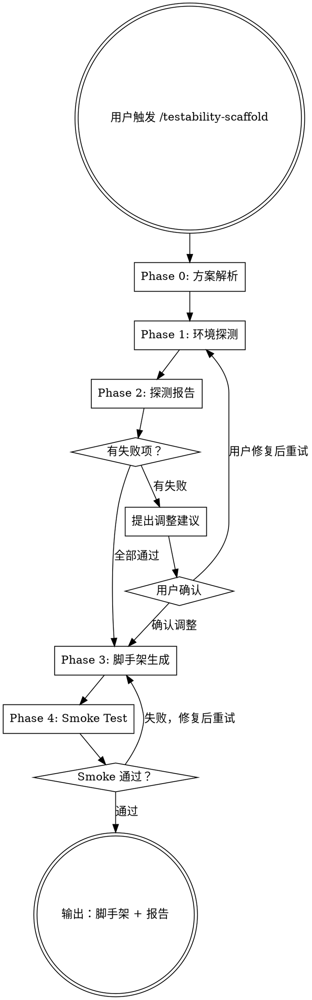

# Testability Scaffold — 环境确认 + 测试脚手架生成器

基于阶段一的可观测性方案，**验证环境 → 生成脚手架 → smoke test 跑通**。

输入是一份已审阅通过的可观测性方案（阶段一产出），输出是可运行的测试基础设施代码。

<HARD-GATE>
必须先读取并理解可观测性方案，才能开始任何探测。不要凭空猜测环境情况——方案文档中已经包含了所有需要验证的前置条件。
</HARD-GATE>

## 核心原则

```
策略驱动，一切探测基于阶段一产出的前置条件 checklist
探测即验证，每次探测都是一个可观测的 pass/fail
失败不阻塞，通道不可用时调整策略而非报错停止
脚手架即代码，产出物是可运行的代码不是文档
smoke test 收尾，一个最小测试跑通证明一切就绪
跟随项目技术栈，不预设语言/框架，看项目用什么就用什么
```

## Checklist

你 MUST 按顺序完成以下步骤，为每个步骤创建 task：

1. **Phase 0: 方案解析** — 读取可观测性方案，提取探测清单和关键信息
2. **Phase 1: 环境探测** — 按依赖顺序逐项探测
3. **Phase 2: 探测报告 + 策略调整** — 展示结果，处理失败项
4. **Phase 3: 脚手架生成** — 基于确认后的环境生成代码
5. **Phase 4: Smoke Test** — 运行最小测试验证脚手架可用

## 流程图



---

## Phase 0: 方案解析

读取用户提供的阶段一可观测性方案，提取以下关键信息：

### 必须提取的内容

| 来源 | 提取什么 | 用途 |
|------|---------|------|
| 第 2 节 环境画像 | 技术栈、基础设施详情 | 决定脚手架语言/框架、探测目标 |
| 第 3 节 可观测性方案 | 基础通道、组合通道、触发×观测组合 | 决定需要验证哪些通道 |
| 第 4 节 数据流闭环 | 数据来源、送入方式、验证方式、清理方式 | 决定数据工厂和清理 helper 的设计 |
| 第 5 节 认证方案 | 认证方式、需要用户提供的信息 | 决定认证 helper 的设计 |
| 第 6 节 环境前置条件 | checklist + 验证命令 | **直接作为 Phase 1 的探测清单** |

### 输出

一份结构化的探测计划，列出所有需要验证的项目及其依赖关系。

---

## Phase 1: 环境探测

按依赖链从底层到顶层逐项探测。

### 探测顺序

```
第 1 层：基础运行环境
  └─ 语言版本（node/python/go 等）
  └─ 包管理器（npm/pip/go mod 等）

第 2 层：依赖安装
  └─ 测试框架（vitest/jest/pytest 等）
  └─ SDK 和工具库
  └─ 探测方式：尝试 import/require

第 3 层：认证/凭证
  └─ 凭证是否配置（.env 文件、环境变量）
  └─ 凭证是否有效（尝试获取 token/session）
  └─ 这一层失败 = 后续所有通道探测都会失败

第 4 层：基础通道可达性
  └─ DB 连通性（如策略需要 DB 验证）
  └─ API 可达性（如策略需要 API 验证）
  └─ 浏览器可达性（如策略需要 UI 验证）
  └─ 文件系统权限（如策略需要文件验证）

第 5 层：组合通道可用性
  └─ SDK 功能验证（不只是 import 通过，还要能执行基本操作）
  └─ 辅助工具/脚本可用性

第 6 层：数据操作权限
  └─ 能否创建测试数据
  └─ 能否读取/查询数据
  └─ 能否删除/清理数据
```

### 探测输出格式

每项探测使用统一的三态输出：

```
[✅ PASS] <探测项>: <具体结果>
[❌ FAIL] <探测项>: <错误信息> — <建议修复方式>
[⚠️ WARN] <探测项>: <警告信息> — <影响说明>
```

### 探测执行原则

1. **每次只运行一个探测** — 不要并行，因为有依赖关系
2. **执行前向用户确认** — 探测脚本可能涉及网络请求或数据操作
3. **失败时立即报告** — 不要等所有探测完成再说
4. **如果某层全部失败** — 询问用户是否要跳过依赖此层的后续探测

详细的探测命令和模式参见 `probe-patterns.md`。

---

## Phase 2: 探测报告 + 策略调整

### 展示探测结果总表

```
## 环境探测报告

| # | 探测项 | 状态 | 详情 |
|---|--------|------|------|
| 1 | Node.js 版本 | ✅ | v20.11.0 |
| 2 | 飞书 SDK | ✅ | @larksuiteoapi/node-sdk@3.4.2 |
| 3 | 应用凭证 | ✅ | tenant_access_token 获取成功 |
| 4 | 网盘 API | ✅ | listByFolder 正常返回 |
| 5 | Wiki API | ❌ | 403 — 需要申请 wiki:space:read scope |
| 6 | 创建测试文件夹 | ✅ | _fz_test_probe/ 创建并删除成功 |
| 7 | 创建 Wiki 空间 | ❌ | 受 #5 影响，跳过 |

通过: 5/7 | 失败: 2/7
```

### 失败项处理

对每个失败项：

1. **分析影响** — 哪些测试场景依赖这个通道？
2. **提出方案** — 三选一：
   - **用户修复**：给出具体修复步骤（如"去飞书开放平台申请 wiki:space:read 权限"）
   - **替代方案**：用其他通道替代（如 DB CLI 不可用 → 改用 API 查询验证）
   - **跳过**：此通道相关的测试暂时不覆盖，在脚手架中留好扩展点
3. **用户确认** — 等用户决定后再继续

### 策略调整

如果有通道不可用，需要调整方案中的相应部分：
- 更新可观测性方案（标注哪些通道已确认/不可用）
- 更新触发×观测组合（替换不可用的通道）
- 更新数据流闭环（调整数据准备/验证/清理方式）

调整后的信息记录在探测报告中，作为 Phase 3 的输入。

---

## Phase 3: 脚手架生成

基于确认后的环境能力生成测试基础设施代码。

### 必须生成的模块

无论什么技术栈，脚手架必须包含以下 5 个模块：

**1. 认证 helper**
- 封装方案文档第 5 节的认证方案为可复用的函数
- 处理 token 缓存/刷新（如果适用）
- 提供认证状态检查函数

**2. 通道客户端**
- 封装每个已确认可用的观测通道为客户端实例
- 基础通道（DB client、HTTP client 等）和组合通道（SDK client 等）
- 不可用的通道：留好接口但标注 `// TODO: 此通道当前不可用，待环境就绪后实现`

**3. 数据工厂**
- 封装方案文档第 4 节的数据准备方案
- 提供创建各类测试数据的函数
- 数据隔离：所有测试数据使用统一前缀/命名空间

**4. 数据清理**
- 封装方案文档第 4 节的清理方案
- 提供清理函数（按资源类型）
- 全局 teardown 钩子
- 注意：清理不一定是物理删除，某些系统可能需要软删除、归档或移入回收站

**5. Smoke test**
- 最小可运行测试，验证整个脚手架链路
- 覆盖：认证 → 数据创建 → 观测验证 → 数据清理
- 跑通 = 脚手架就绪

### 生成原则

参见 `scaffold-guide.md` 了解通用的生成指导原则。

### 文件放置

- 默认放在项目的 `test/` 目录下
- 如果项目已有测试目录结构，遵循现有约定
- 向用户确认文件放置位置
- 生成 `.env.test` 后，检查 `.gitignore` 是否包含它——如果没有，自动添加并提醒用户

---

## Phase 4: Smoke Test

### 运行 smoke test

执行 Phase 3 生成的 smoke test 文件。

### 通过标准

1. 认证成功（获取到有效凭证）
2. 至少一个观测通道可用（能查询到数据）
3. 数据创建成功（能创建测试数据）
4. 数据清理成功（测试数据被正确清理）

### 失败处理

如果 smoke test 失败：
1. 分析失败原因（是脚手架代码的 bug 还是环境问题）
2. 修复脚手架代码或引导用户修复环境
3. 重新运行直到通过

### 完成输出

Smoke test 通过后：
1. 告知用户阶段二完成
2. 总结已确认的环境能力和脚手架内容
3. 提示用户可以进入阶段三——运行 `/testability-cases @<方案文档路径> @<test目录>` 生成测试用例文档和数据蓝图

---

## 注意事项

### 探测安全

- **不要执行破坏性操作** — 探测只做读取和最小创建（创建后立即删除）
- **每次探测前向用户确认** — 特别是涉及网络请求、数据操作的
- **保护凭证** — 不要在输出中打印完整的 token/secret，只打印前几位

### 脚手架质量

- 生成的代码必须是**可直接运行的** — 不是伪代码，不是示例
- 所有硬编码值都从环境变量读取（`.env.test`）
- 代码风格跟随项目现有风格（缩进、命名、模块系统）

### 与阶段一的关系

- 阶段二不修改阶段一的可观测性方案原文
- 如果需要调整策略，调整内容记录在探测报告中
- 阶段二产出的脚手架代码是阶段三生成测试用例的基础

---

## 参考文件

- `probe-patterns.md` — 各类环境探测的模式库
- `scaffold-guide.md` — 脚手架代码生成指导原则
- `examples/cli-feishu-scaffold.md` — fz 项目的完整阶段二示例
