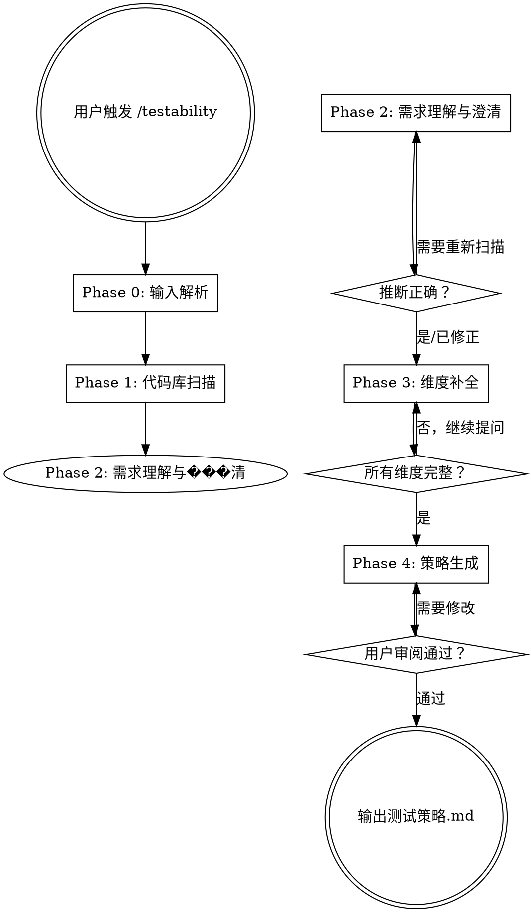

# Testability — 自反馈测试策略生成器

基于用户的需求和实际开发环境，生成一份**测试策略提案**。这份提案对齐测试理念和方向——我们打算怎么测、为什么这么测——是 Vibe Coding 自反馈循环的第一步。

阶段一产出的是策略，不是详细用例。详细的测试用例和数据准备属于阶段三。

<HARD-GATE>
在所有维度信息收集完成之前，不要生成测试策略。不完整的环境信息会导致不可行的策略。
</HARD-GATE>

## 核心原则

```
推断优先，不问能推断的
一次一问，不抛一堆问题
组合化思维，不贴角色标签
不问隐私，不问无关信息
动态探测，能验证的不靠猜
集成优先，尽可能做端到端的真实验证
策略先行，先对齐理念再展开细节
可观测性驱动，触发和观测走不同通道，不用被测系统验证自己
```

## 核心测试理念

### 集成测试优先

所有测试尽可能做集成验证，不追求纯单元测试。分层是按**业务模块**分，而不是按技术层分：

```
第 1 层：认证/公共模块 — 先确保基础能力通
第 2 层：核心业务模块 — 在基础通过后验证业务
第 3 层：端到端全链路 — 从用户视角跑完整流程
```

每一层都是集成的——连接真实数据库、调真实 API、操作真实 UI。

### 数据流闭环

每个测试都要回答四个问题：

```
1. 数据从哪来？
   本地文件/DB seed → 确定性最高
   通过 API 创建   → 中等确定性
   用已有数据       → 最不可控
   mock/replay     → 用于不可控的外部数据源

2. 数据怎么送入环境？
   DB 直接写入     → 最快、最可控
   API 调用创建    → 当无 DB 权限时
   UI 操作创建     → 最慢、最后选择
   文件系统放置    → 静态测试数据

3. 怎么验证结果？
   独立通道验证（DB 查询）  → 最可靠，避免被测模块自证
   SDK + 凭证直查           → 第三方系统的独立验证
   API 交叉查询            → 当无 DB 权限时
   UI 元素检查             → 当只有浏览器时
   输出比对（stdout/日志）  → CLI 工具等场景

4. 怎么清理？
   DB reset/truncate    → 可清空时
   API DELETE           → 有权限时
   标记隔离（前缀/标记） → 定期清理
   不清理               → 数据不重要时
```

核心原则：**准备走底层通道（能 DB 就不走 API），验证走独立通道（不要用被测模块验证自己）。**

### 渐进式真实度

当系统涉及**金钱、时间流、外部副作用**时，采用渐进式验证：

```
Mock/本地模拟  →  服务商沙盒环境  →  真实环境最小验证
（最安全）        （接近真实）        （需用户授权）
```

- **优先用服务商提供的沙盒**（如支付宝沙盒、券商模拟盘）— 最省力、最接近真实
- **没有沙盒则自己 mock** — 可控但需要维护
- **沙盒跑通后再考虑真实最小验证** — 目的是验证「系统打通」，不是验证业务逻辑
- **不是所有系统都需要三层** — 简单项目只需要第一层

适用场景：支付系统、交易系统、消息发送（邮件/短信）、第三方 OAuth、定时任务、消息队列等。

---

## Checklist

你 MUST 按顺序完成以下步骤，为每个步骤创建 task：

1. **Phase 0: 输入解析** — 解析用户传入的参数
2. **Phase 1: 代码库扫描** — 自动推断六大维度信息
3. **Phase 2: 需求理解与澄清** — 展示推断结果，用户确认/修正
4. **Phase 3: 维度补全** — 逐维度补问缺失信息
5. **Phase 4: 策略生成** — 生成测试策略提案 markdown，用户审阅

## 流程图



---

## Phase 0: 输入解析

解析用户在触发 `/testability` 时传入的参数：

- **文档路径**（如 `@docs/spec.md` 或用户说"需求在 xxx.md 中"）→ 读取文档，提取需求
- **自然语言描述**（如"我要测试用户注册流程"）→ 记录需求
- **无参数** → 进入纯代码库推断模式，Phase 2 时再和用户讨论需求

无论哪种输入，都记录下来，作为后续扫描和提问的上下文。

---

## Phase 1: 代码库扫描（智能推断）

自动扫描当前代码库，推断六大维度的信息。你自行决定扫描策略，但需要覆盖以下推断目标：

- 项目类型和技术栈（语言、框架、依赖）
- 数据库类型和配置方式（ORM、migration、连接配置）
- 已有的测试基础设施（测试框架、测试文件、CI 配置）
- API / 路由结构（端点清单、GraphQL schema）
- 认证方式（auth 中间件、JWT/session 配置）
- 部署和运行方式（Docker、Makefile、启动脚本）
- **可观测性资源**：项目依赖中的第三方 SDK（如飞书 SDK、AWS SDK、Stripe SDK）、`.env` 中的 API Key/Secret、已有的辅助脚本和测试工具（`scripts/`、`tools/`、`test/helpers/`）

将推断结果整理为结构化的「环境画像」，准备展示给用户。

参考 `dimensions.md` 了解每个维度的详细定义和推断线索。

---

## Phase 2: 需求理解与澄清

### 展示推断结果

将 Phase 1 的推断结果清晰地展示给用户。格式示例：

```
基于代码库扫描，我推断出以下信息：

【代码仓库】Next.js 全栈应用（TypeScript）
【技术栈】Next.js 14 + PostgreSQL + Prisma + NextAuth
【数据库】本地 Docker PostgreSQL（从 docker-compose.yml 推断）
【测试现状】Playwright 已配置但无测试用例
【API 结构】发现 15 个 API 路由（/api/auth/*, /api/users/*, ...）
【认证方式】NextAuth + credentials provider
【部署方式】Docker Compose 本地开发

以上推断是否正确？有哪些需要修正？
```

### 澄清需求

结合代码库信息和用户输入，讨论测试目标：
- 具体要测试哪些功能？
- 测试的深度和广度是什么？
- 有没有特别关注的风险点？

如果用户在 Phase 0 没有提供需求，这里需要引导用户描述。

---

## Phase 3: 维度补全

对仍然缺失或不确定的维度逐一提问。

### 提问原则

1. **能推断的不问** — 已从代码库确认的不再重复
2. **一次只问一个维度** — 不要一次抛出一堆问题
3. **提供选项** — 尽可能给选择题而非开放题
4. **动态探测** — 某些问题可以通过运行脚本来验证，优先用脚本而非提问

### 动态探测

对可验证的维度，可以动态生成探测脚本。例如：
- 测试数据库连通性：`psql -h localhost -U postgres -c '\l'`
- 测试服务可达性：`curl -s -o /dev/null -w "%{http_code}" http://localhost:3000`
- 检查 Docker 状态：`docker compose ps`
- 检查端口占用：`lsof -i :3000`
- 检查 SDK 可用性：`node -e "require('@larksuiteoapi/node-sdk')"`

在运行探测脚本之前，向用户确认。

### 可观测性维度的提问策略

可观测性维度需要特别注意提问顺序：
1. **先识别基础通道** — 基于已推断的基础设施信息，确认用户可以使用哪些基础观测通道（浏览器、DB CLI、API 等）
2. **再探测组合通道** — 主动询问是否有可用的第三方 SDK + 凭证、辅助脚本等。这些往往是扩展观测能力的关键
3. **确定触发×观测组合** — 针对需要测试的功能，明确每个测试场景的触发通道和观测通道分别是什么

### 六大维度

详细的维度定义、可能值和提问指南参见 `dimensions.md`。

---

## Phase 4: 策略生成

基于完整的六大维度信息，使用 `output-template.md` 中的模板生成测试策略提案。

### 输出定位

阶段一输出的是**测试策略提案**，核心回答三个问题：

1. **我们理解你的系统** — 环境画像和维度快照
2. **我们打算这样测** — 测试理念、分层策略、数据流闭环方案
3. **我们建议这个顺序** — 集成测试分层、渐进式真实度（如适用）

用 1-2 个示例说明测试思路即可，不要铺开完整的测试用例清单。

### 输出要求

1. 策略保存为 markdown 文件，位置由用户决定（默认 `docs/test-strategy.md`）
2. 重点是测试理念和策略方向，不是详细用例
3. 数据流闭环（准备→送入→验证→清理）必须说清楚
4. 涉及���钱/时间流/外部副作用时，必须提出渐进式真实度策略
5. 环境前置条件 checklist 是给阶段二（环境探测验证）使用的

### 用户审阅

生成策略后交由用户审阅。这是一次**理念对齐**——像广告公司向甲方提案，先对齐方向，再展开细节。如果用户对策略方向有异议，调整后重新生成。

---

## 注意事项

### 不要做的事

- 不要用角色标签（如"大厂开发者"、"个人开发者"）来分类用户
- 不要问团队规模等隐私问题
- 不要假设用户的环境——推断或问
- 不要一次性问太多问题
- 不要在阶段一就铺开完整的测试用例清单
- 不要生成不可执行的泛泛而谈的策略

### 组合化思维

每个用户的真实环境是六大维度值的**唯一组合**。例如：
- DB 本地可清空 + 服务本地 + 前端本地 + 可自注册
- DB 远程只读 + 服务本地 + 无前端 + 需提供密码
- 无 DB 访问 + API 远程 dev + 前端本地连远程 + cookie 导入

不要试图把用户塞进预设的场景模板。用维度组合来描述实际情况。

参考 `examples/` 目录下的示例了解典型组合的策略提案。

---

## 参考文件

- `dimensions.md` — 六大维度的详细定义、可能值、推断线索、提问模板
- `output-template.md` — 测试策略提案输出 markdown 模板
- `examples/` — 典型维度组合的策略提案示例
