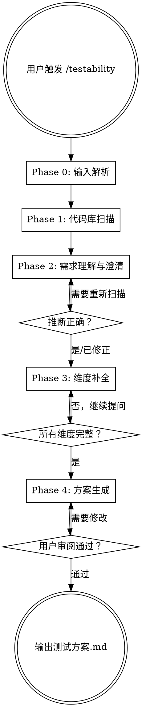

# Testability — 自反馈测试方案生成器

基于用户的需求和实际开发环境，动态生成一份可执行的测试方案。这份方案是 Vibe Coding 自反馈循环的基础 —— 让 AI 生成的代码能被自动测试、发现问题、持续修复。

<HARD-GATE>
在所有维度信息收集完成之前，不要生成测试方案。不完整的环境信息会导致不可执行的方案。
</HARD-GATE>

## 核心原则

```
推断优先，不问能推断的
一次一问，不抛一堆问题
组合化思维，不贴角色标签
不问隐私，不问无关信息
动态探测，能验证的不靠猜
输出可执行，命令具体到可直接运行
```

## Checklist

你 MUST 按顺序完成以下步骤，为每个步骤创建 task：

1. **Phase 0: 输入解析** — 解析用户传入的参数
2. **Phase 1: 代码库扫描** — 自动推断六大维度信息
3. **Phase 2: 需求理解与澄清** — 展示推断结果，用户确认/修正
4. **Phase 3: 维度补全** — 逐维度补问缺失信息
5. **Phase 4: 方案生成** — 生成测试方案 markdown，用户审阅

## 流程图



---

## Phase 0: 输入解析

解析用户在触发 `/testability` 时传入的参数：

- **文档路径**（如 `@docs/spec.md` 或用户说"需求在 xxx.md 中"）→ 读取文档，提取需求
- **自然语言描述**（如"我要测试用户注册流程"）→ 记录需求
- **无参数** → 进入纯代码库推断模式，Phase 2 时再和用户讨论需求

无论哪种输入，都记录下来，作为后续扫描和提问的上下文。

---

## Phase 1: 代码库扫描（智能推断）

自动扫描当前代码库，推断六大维度的信息。你自行决定扫描策略，但需要覆盖以下推断目标：

- 项目类型和技术栈（语言、框架、依赖）
- 数据库类型和配置方式（ORM、migration、连接配置）
- 已有的测试基础设施（测试框架、测试文件、CI 配置）
- API / 路由结构（端点清单、GraphQL schema）
- 认证方式（auth 中间件、JWT/session 配置）
- 部署和运行方式（Docker、Makefile、启动脚本）

将推断结果整理为结构化的「环境画像」，准备展示给用户。

参考 `dimensions.md` 了解每个维度的详细定义和推断线索。

---

## Phase 2: 需求理解与澄清

### 展示推断结果

将 Phase 1 的推断结果清晰地展示给用户。格式示例：

```
基于代码库扫描，我推断出以下信息：

【代码仓库】Next.js 全栈应用（TypeScript）
【技术栈】Next.js 14 + PostgreSQL + Prisma + NextAuth
【数据库】本地 Docker PostgreSQL（从 docker-compose.yml 推断）
【测试现状】Playwright 已配置但无测试用例
【API 结构】发现 15 个 API 路由（/api/auth/*, /api/users/*, ...）
【认证方式】NextAuth + credentials provider
【部署方式】Docker Compose 本地开发

以上推断是否正确？有哪些需要修正？
```

### 澄清需求

结合代码库信息和用户输入，讨论测试目标：
- 具体要测试哪些功能？
- 测试的深度和广度是什么？
- 有没有特别关注的风险点？

如果用户在 Phase 0 没有提供需求，这里需要引导用户描述。

---

## Phase 3: 维度补全

对仍然缺失或不确定的维度逐一提问。

### 提问原则

1. **能推断的不问** — 已从代码库确认的不再重复
2. **一次只问一个维度** — 不要一次抛出一堆问题
3. **提供选项** — 尽可能给选择题而非开放题
4. **动态探测** — 某些问题可以通过运行脚本来验证，优先用脚本而非提问

### 动态探测

对可验证的维度，可以动态生成探测脚本。例如：
- 测试数据库连通性：`psql -h localhost -U postgres -c '\l'`
- 测试服务可达性：`curl -s -o /dev/null -w "%{http_code}" http://localhost:3000`
- 检查 Docker 状态：`docker compose ps`
- 检查端口占用：`lsof -i :3000`

在运行探测脚本之前，向用户确认。

### 六大维度

详细的维度定义、可能值和提问指南参见 `dimensions.md`。

---

## Phase 4: 方案生成

基于完整的六大维度信息，使用 `output-template.md` 中的模板生成测试方案 markdown 文件。

### 输出要求

1. 方案保存为 markdown 文件，位置由用户决定（默认 `docs/test-plan.md`）
2. 方案中的工具和命令必须**具体到可直接执行**
3. 每个测试目标都要标明使用哪个验证通道
4. 环境前置条件 checklist 是给阶段二（环境探测验证）使用的

### 用户审阅

生成方案后交由用户审阅。如果用户有修改意见，调整后重新生成。

---

## 注意事项

### 不要做的事

- 不要用角色标签（如"大厂开发者"、"个人开发者"）来分类用户
- 不要问团队规模等隐私问题
- 不要假设用户的环境——推断或问
- 不要一次性问太多问题
- 不要生成不可执行的泛泛而谈的方案

### 组合化思维

每个用户的真实环境是六大维度值的**唯一组合**。例如：
- DB 本地可清空 + 服务本地 + 前端本地 + 可自注册
- DB 远程只读 + 服务本地 + 无前端 + 需提供密码
- 无 DB 访问 + API 远程 dev + 前端本地连远程 + cookie 导入

不要试图把用户塞进预设的场景模板。用维度组合来描述实际情况。

参考 `examples/` 目录下的示例了解典型组合。

---

## 参考文件

- `dimensions.md` — 六大维度的详细定义、可能值、推断线索、提问模板
- `output-template.md` — 测试方案输出 markdown 模板
- `examples/` — 典型维度组合示例
