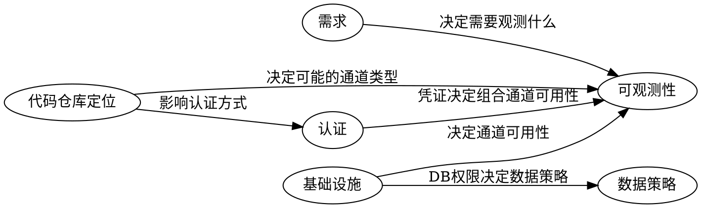

# 六大核心维度

每个维度有多种可能值。真实场景是这些维度值的组合。你的目标是通过扫描代码库和与用户沟通，确定每个维度的实际值。

---

## 维度 1：需求

**目标：** 搞清楚用户要开发/测试什么功能。

### 信息来源（按优先级）

1. 用户提供的 spec 文档或需求描述
2. 用户口头描述
3. 代码库最近的改动（git log、未提交的变更）
4. 代码库整体结构推断

### 推断线索

- `git log --oneline -20` — 最近在做什么
- `git diff --stat` — 当前有什么改动
- README.md、docs/ 目录 — 项目说明
- TODO、FIXME 注释 — 待办事项

### 需要确认的内容

- 具体要测试哪些功能/流程？
- 测试的优先级？哪些是关键路径？
- 有没有已知的风险点或历史 bug？

---

## 维度 2：代码仓库定位

**目标：** 搞清楚这个 repo 到底是什么，以及用户能操作的范围。

### 可能值

| 值 | 说明 |
|----|------|
| 前端应用 | React/Vue/Angular/Svelte 等前端项目 |
| 后端服务 | Express/Fastify/Django/Rails/Go 等后端项目 |
| 全栈应用 | Next.js/Nuxt/SvelteKit 等前后端一体 |
| 微服务中的某个服务 | 只是整个系统中的一部分 |
| 桌面应用 | Electron/Tauri/原生桌面 |
| 移动端应用 | React Native/Flutter/原生移动 |
| CLI 工具 | 命令行工具 |
| 库/SDK | 供其他项目使用的库 |

### 推断线索

- `package.json` 的 dependencies — React/Vue = 前端, Express/Fastify = 后端, Next.js = 全栈
- 目录结构 — `pages/`/`app/`/`components/` 暗示前端; `routes/`/`controllers/` 暗示后端
- `docker-compose.yml` 中的服务数量 — 多服务暗示微服务
- `electron-builder.yml`/`tauri.conf.json` — 桌面应用
- `android/`/`ios/` 目录 — 移动端

### 关联 repo

确认用户是否有其他相关 repo 可以联动：
- 后端开发者是否有前端 repo 可以一起测试？
- 微服务开发者是否有其他相关服务的 repo？
- 是否有共享的类型定义/SDK repo？

### 提问模板

```
我看到这是一个 [推断的类型] 项目。除了这个 repo，你是否还有其他相关的 repo 可以一起联动测试？
比如你有前端/后端/其他服务的代码仓库吗？
```

---

## 维度 3：基础设施

**目标：** 搞清楚服务端、数据库、前端分别在哪里，能不能在本地运行。

### 3.1 服务端

| 可能值 | 说明 | 推断线索 |
|--------|------|----------|
| 本地可运行 | 可以在本地启动服务 | 有 `npm start`/`docker compose up` 等启动脚本 |
| 本地跑不起来 | 依赖太多或环境太复杂 | 需要多个微服务配合、依赖内部基础设施 |
| 远程 dev 环境可用 | 有可访问的开发/测试环境 | `.env` 中有远程 URL、CI 配置中有 staging 地址 |
| 只有生产环境 | 无法用于测试 | 只有 production 配置 |

### 3.2 数据库

| 可能值 | 说明 | 推断线索 |
|--------|------|----------|
| 本地 + 可清空 | 完全控制 | docker-compose 中有 DB 服务、本地连接配置 |
| 本地 + 只读 | 本地有但不能随意改 | 少见，通常需要用户确认 |
| 远程 + 可读写 | 远程 DB 有写权限 | `.env` 中有远程 DB URL |
| 远程 + 只读 | 只能查询验证 | 需要用户确认权限 |
| 无访问权限 | 完全不能直接访问 | 无 DB 配置文件或只通过 API 访问 |

### 3.3 前端

| 可能值 | 说明 | 推断线索 |
|--------|------|----------|
| 本地开发可运行 | 前端在本地跑 | 有前端代码 + dev server 配置 |
| 本地部署 + 连远程 API | 前端本地，API 在远程 | 有 proxy 配置指向远程 API |
| 远程 dev 环境 | 前端部署在远程 | 只有远程 URL |
| 无前端 | 纯 API / CLI | 无前端代码 |

### 推断线索汇总

- `docker-compose.yml` — 有哪些服务，数据库是否本地
- `.env` / `.env.example` — 数据库连接串是 localhost 还是远程地址
- `Makefile` / `package.json scripts` — 启动命令
- `Dockerfile` — 部署方式
- migration 文件 — 数据库类型和结构
- proxy 配置 — API 在哪里

### 提问模板

```
关于运行环境，我需要确认几个问题：

你的服务可以在本地启动运行吗？还是需要连接远程的 dev 环境？
```

```
关于数据库：
- 数据库是在本地（如 Docker）还是远程？
- 你对数据库有什么样的权限？可以清空重建吗？还是只能读取？
```

---

## 维度 4：可观测性

**目标：** 搞清楚有哪些手段可以用来**触发动作**和**观测结果**，以及它们如何组合。

### 核心理念

可观测性模拟的是人类测试工程师的行为方式：基于自身所处的环境、可用的工具、拥有的权限，选择最优的方式来验证系统是否正常工作。

关键认知：
- **触发**和**观测**是两个独立的动作，可以走不同的通道
- 例：浏览器触发操作 → psql 查数据库验证；curl 发请求 → UI 界面看结果
- 不同环境/权限下，可用的观测手段不同，测试方案必须适配实际条件

### 基础通道

分为 3 大类 10 种。每种通道既可以作为**触发通道**（发起动作），也可以作为**观测通道**（验证结果）。

#### I. 界面观测

| 通道 | 工具 | 作为触发 | 作为观测 | 推断线索 |
|------|------|---------|---------|----------|
| 浏览器页面 | Playwright / Puppeteer | 点击、填写表单、导航 | 检查 DOM 状态、UI 渲染结果 | 有前端代码 |
| APP/客户端界面 | mac-use / ADB / Appium | 操作移动端/桌面端 UI | 检查界面状态、元素存在性 | 移动端/桌面端项目 |
| 浏览器 DevTools | Console / Network tab | — | 检查 Console 日志、Network 请求/响应 | 有前端代码 |

#### II. 数据观测

| 通道 | 工具 | 作为触发 | 作为观测 | 推断线索 |
|------|------|---------|---------|----------|
| 数据库直查 | psql / mysql / mongosh | INSERT/UPDATE 测试数据 | SELECT 验证数据状态 | 有 DB 配置 + 有 CLI 权限 |
| API 请求 | curl / fetch / Postman | POST/PUT/DELETE 操作 | GET 查询验证结果 | 有路由/端点 |
| 缓存/队列/事件流 | redis-cli / wscat / kafka-console-consumer | 发布消息/事件 | 检查缓存值、消费消息、监听事件 | 有 Redis/WS/Kafka 等配置 |
| 文件系统 | 文件读写 | 放置输入文件 | 检查输出文件的创建/内容/修改 | 有文件操作代码 |

#### III. 过程观测

| 通道 | 工具 | 作为触发 | 作为观测 | 推断线索 |
|------|------|---------|---------|----------|
| 命令执行结果 | CLI 工具 / 脚本 | 执行一次性命令 | 检查返回值和输出 | 有 CLI 入口 |
| 进程流式输出 | tail -f / docker logs -f | — | 持续监听运行中进程的 stdout/stderr | 有长期运行的服务 |
| 日志系统 | 日志文件 / ELK / CloudWatch | — | 事后查询结构化日志 | 有日志配置 |

### 组合通道

基于基础通道封装，但提供**质变的观测能力**。在很多场景下，组合通道是唯一可行的观测路径。

| 类型 | 说明 | 典型例子 |
|------|------|---------|
| **SDK + 凭证** | 封装了认证 + 领域逻辑的高级访问方式。将"理论上可行但实际极复杂"变为"几行代码即可" | 飞书 Node SDK + 秘钥 → 直接读写飞书文档数据（无 SDK 则需找到 HTTP 端点 + 组合多个请求 + 处理认证） |
| **自建辅助 API** | 临时开发专门用于测试验证的端点，创造原本不存在的观测能力 | 后端开发者没有 DB 直连权限 → 开发一个 `/debug/query` 端点用于验证数据 |
| **自动化脚本** | 将多个基础通道编排成一个可重复执行的观测流程 | 脚本串联：API 创建数据 → 等待处理 → DB 查询验证 → API 清理 |

#### 组合通道的关键特征

- 它们不是"方便"，而是在很多场景下**决定了这个观测维度是否可行**
- 在维度收集阶段需要主动探测：项目中有哪些 SDK 可用？是否有现成的辅助工具/脚本？
- SDK 的可用性 = SDK 存在 + 凭证/秘钥可用 + Agent 有能力使用它

#### 组合通道的推断线索

- `package.json` / `requirements.txt` / `go.mod` 中的 SDK 依赖（如 `@larksuiteoapi/node-sdk`、`boto3`、`stripe`）
- 项目中已有的辅助脚本（`scripts/`、`tools/` 目录）
- `.env` 中的第三方服务 API Key / Secret
- 已有的测试工具代码（`test/helpers/`、`test/utils/`）

### 触发 × 观测 组合示例

真实测试中，触发和观测经常走不同的通道：

| 场景 | 触发通道 | 观测通道 | 说明 |
|------|---------|---------|------|
| Web 应用数据验证 | 浏览器页面（提交表单） | 数据库直查（SELECT 验证） | 最强验证：UI 操作 + 独立数据源确认 |
| 浏览器网络检查 | 浏览器页面（点击按钮） | 浏览器 DevTools（Network 抓包） | 验证前端发出的请求是否正确 |
| API 结果在 UI 展示 | API 请求（POST 创建数据） | 浏览器页面（查看 UI 是否展示） | 反向验证：后端操作 → 前端呈现 |
| 无 DB 权限的黑盒测试 | API 请求（POST 创建） | API 请求（GET 查询） | 自身验证，需在策略中注明局限性 |
| CLI 包装第三方服务 | 命令执行（CLI 命令） | SDK + 凭证（SDK 直接查询服务） | 不用 CLI 验证 CLI，用独立通道 |
| 多角色业务流程 | 浏览器页面（角色A 发起审批） | 浏览器页面（角色B 查看审批） | 同一通道类型，不同会话/身份 |
| 后端开发无 DB 直连 | API 请求（POST 业务操作） | 自建辅助 API（GET 查询验证） | 组合通道创造观测能力 |
| 第三方集成验证 | 命令执行（业务操作） | SDK + 凭证（查询第三方系统状态） | SDK 让不可行变为可行 |

### 可观测性的核心原则

1. **触发和观测尽量走不同通道** — 不要用被测系统验证自己
2. **当无法走不同通道时** — 明确标注"此处为自身验证"，说明为什么可以接受
3. **优先探测组合通道** — SDK、辅助工具等可能大幅扩展观测能力
4. **观测通道的选择由环境决定** — 不是"最好用什么"，而是"实际能用什么"

### 探测方式

对于每个潜在通道，可以动态生成探测脚本验证其可用性：

```bash
# 浏览器可达性
curl -s -o /dev/null -w "%{http_code}" http://localhost:3000

# 数据库连通性
psql -h localhost -U postgres -c '\l' 2>/dev/null && echo "OK" || echo "FAIL"

# API 可达性
curl -s http://localhost:3000/api/health

# Docker 服务状态
docker compose ps 2>/dev/null

# 端口占用检查
lsof -i :3000 -i :5432 2>/dev/null

# SDK 可用性（检查依赖是否安装）
node -e "require('@larksuiteoapi/node-sdk')" 2>/dev/null && echo "SDK OK" || echo "SDK NOT FOUND"
```

### 提问模板

```
关于测试验证方式，我需要了解你可以通过哪些渠道来观测系统行为：

1. 你可以用浏览器访问系统吗？（URL 是什么？）
2. 你可以用 CLI 直连数据库吗？（如 psql、mysql）
3. 你可以直接调用 API 吗？
4. 项目中有没有第三方服务的 SDK 和对应的凭证/秘钥？（如飞书 SDK、AWS SDK）
5. 有没有现成的辅助脚本或工具可以用来验证？
```

---

## 维度 5：认证

**目标：** 搞清楚如何获取登录态来进行测试。

### 可能值

| 值 | 说明 | 适用场景 |
|----|------|----------|
| 可以自注册 | 通过注册流程创建测试账号 | 本地开发、有完整注册功能 |
| 提供用户名密码 | 用户提供测试账号凭据 | 有现成测试账号 |
| Cookie/Token 导入 | 用户提供认证 cookie 或 token | 无法程序化登录 |
| Auth 文件导入 | 使用 Playwright auth state 等文件 | 复杂认证流程 |
| 不需要认证 | 公开服务或本地开发模式 | 无认证要求的接口 |
| OAuth/SSO | 第三方认证，需特殊处理 | 企业内部系统 |
| API Key | 使用 API 密钥认证 | API 服务 |

### 推断线索

- auth 相关的 middleware/路由 — 认证方式
- NextAuth/Passport/JWT 配置 — 具体技术
- 注册页面/API 是否存在 — 是否可以自注册
- `.env` 中的 OAuth 配置 — 是否依赖第三方认证

### 决策逻辑

```
if 项目有完整的注册流程 && 可以本地运行:
    → 优先使用自注册
elif 用户可以提供测试账号:
    → 请求用户名密码
elif 认证流程太复杂（OAuth/SSO）:
    → 请求 cookie/token/auth 文件导入
elif 无认证需求:
    → 跳过
```

### 提问模板

```
关于认证/登录：
我看到项目使用了 [推断的认证方式]。
为了测试，我们怎么获取登录态？

- 我可以通过注册流程自动创建测试账号
- 你提供一个测试用的用户名和密码
- 你提供一个有效的 cookie 或 token
- 这个功能不需要认证
```

---

## 维度 6：数据策略

**目标：** 搞清楚测试数据怎么准备和清理。

### 可能值

| 值 | 说明 | 前提条件 |
|----|------|----------|
| 可以清空重建 | drop + seed，完全重置 | DB 在本地 + 可清空 |
| 只能追加 | 可以插入测试数据但不能删除已有数据 | DB 有写权限 |
| 只能用现有数据 | 不能修改任何数据 | DB 只读 |
| 需要 seed 脚本 | 有现成的数据初始化脚本 | 项目有 seed 配置 |
| 需要通过 UI 创建 | 测试数据需要通过页面操作创建 | 无 DB 直接访问 |
| 需要通过 API 创建 | 通过 API 调用创建测试数据 | 有数据创建接口 |

### 推断线索

- 数据库维度的权限 — 直接决定数据策略
- `prisma/seed.ts`、`db/seeds/` — 有现成 seed 脚本
- migration 文件 — 可以重建数据库
- fixture 文件 — 有测试数据模板

### 组合约束

数据策略受基础设施维度中数据库权限的约束：

| 数据库权限 | 可用的数据策略 |
|------------|---------------|
| 本地 + 可清空 | 清空重建、追加、seed 脚本 |
| 本地 + 只读 | 只能用现有数据 |
| 远程 + 可读写 | 追加、通过 API/UI 创建（不建议清空远程 DB） |
| 远程 + 只读 | 只能用现有数据 |
| 无访问权限 | 通过 UI 创建、通过 API 创建 |

### 提问模板

```
关于测试数据：
你的数据库 [推断的权限情况]，所以我们可以：

- 清空数据库并用 seed 脚本重建测试数据
- 在现有数据基础上插入测试数据
- 使用数据库中已有的数据
- 通过页面操作/API 调用来创建测试数据

你倾向哪种方式？
```

---

## 数据流闭环：贯穿所有维度的策略框架

六大维度确定后，你需要基于它们推导出**数据流闭环方案**——这是测试策略的核心。

### 通用模型

每个测试场景都要回答四个问题，答案由维度组合决定：

| 问题 | 决定因素 | 可选方案（按优先级） |
|------|----------|---------------------|
| 数据从哪来？ | 需求 + 基础设施 | 本地文件/DB seed → API 创建 → 用已有数据 → mock/replay |
| 数据怎么送入？ | 基础设施（DB 权限） | DB 直接写入 → API 调用 → UI 操作 → 文件放置 |
| 怎么验证结果？ | 可观测性（观测通道） | 独立通道 DB 查询 → SDK 直查 → API 交叉查询 → UI 检查 → stdout/日志比对 |
| 怎么清理？ | 基础设施（DB 权限）+ 数据策略 | DB reset → API DELETE → 标记隔离 → 不清理 |

### 关键原则

- **准备走底层通道**：能直接操作 DB 就不走 API，能走 API 就不走 UI
- **验证走独立通道**：不要用被测模块验证自己。执行了 `fz mkdir`，不要只用 `fz ls` 验证，要用飞书 API 独立确认
- **当没有独立通道时**：明确标注"此层使用自身验证"，并在策略中说明为什么可以接受

### 渐进式真实度

当系统���及金钱、时间流、外部副作用时，数据流闭环需要分阶段：

```
第 1 阶段：Mock/本地模拟
  准备：历史数据文件 / mock 服务
  验证：比对输出 vs 预期基准文件
  风险：零

第 2 阶段：服务商沙盒环境（优先选择，如果有的话）
  准备：沙盒中创建���试数据
  验证：通过沙盒 API 查询
  风险：低

第 3 阶段：真实环境最小验证（需用户授权）
  准备：最小规模真实数据
  验证：真实环境查询
  目的：验证系统打通，不是验证业务逻辑
```

如果没有服务商沙盒，退而求其次自己 Mock。不是所有系统都需要三层。

### 典型场景的数据流闭环

| 场景 | 准备 | 送入 | 验证 | 清理 |
|------|------|------|------|------|
| 全栈（本地 DB 可清空） | DB seed | SQL INSERT | DB 查询 + UI 检查 | DB reset |
| 后端 API（无 DB 权限） | 通过 API POST | API 调用 | API GET 交叉查询 | API DELETE |
| 前端（远程 API） | 用已有数据或 UI 创建 | 浏览器操作 | UI 元素 + API 查询 | UI 操作删除或不清理 |
| CLI 包装远程 API | SDK 直接调 API | SDK 调用 | SDK 独立查询（非 CLI 自身） | SDK 调 API 删除 |
| 量化交易 | 历史行情回放 | 文件/mock 数据源 | 信号输出 vs 基准文件 + DB 持仓比对 | DB reset |
| 微服务（只负责一个） | SQL INSERT 自有表 + 依赖服务 API | SQL + API | SQL 查自有表 + 依赖服务 API 查 | DELETE WHERE 测试标记 |

---

## 维度之间的依赖关系



建议的提问顺序：
1. 需求（如果还不清楚）
2. 代码仓库定位（通常可以推断）
3. 基础设施（部分可推断，部分需确认）
4. 认证（依赖基础设施信息）
5. 可观测性（依赖以上所有；先识别基础通道，再探测组合通道）
6. 数据策略（依赖基础设施中的 DB 权限）
